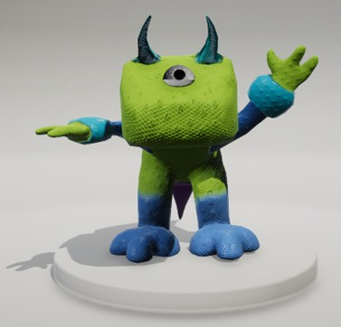

# 3D Character Design

A stylized 3D character design project developed using Autodesk Maya, Adobe Substance 3D Painter, and Unity. This project focuses on character modeling, UV mapping, texturing, lighting, and cross-software workflow integration.

---

## Project Overview

This project was created as part of a university 3D design assignment. The character design combines inspiration from dinosaurs, animated characters, and fantasy elements to create a unique, stylized creature.

The design incorporates:
- Tyrannosaurus Rex body structure
- Stegosaurus-inspired spikes and tail
- Mike Wazowski-inspired single eye
- Devil-inspired curved horns
- Toy Story Alien-inspired colour palette

The project involved:
- 3D character modeling
- UV mapping and unfolding
- PBR texturing workflow
- Material setup
- Unity scene integration
- Lighting and rendering

---

## Tools & Technologies

- Autodesk Maya
- Adobe Substance 3D Painter
- Unity
- FBX Workflow Pipeline

---

## Features

- Stylized one-eyed character design
- Custom dinosaur-inspired body structure
- Hand-modeled horns, spikes, and tail
- UV unwrapping and optimization
- Physically-based texturing workflow
- Unity integration and scene rendering

---

## Workflow

### 1. Modeling in Autodesk Maya
Created the character model using polygon modeling techniques including:
- extrusion
- scaling
- smoothing
- symmetry modeling
- edge manipulation

The character was built using primitive shapes such as cubes and spheres, which were refined into a stylized creature design.

### 2. UV Mapping
Created UV layouts and unfolded the model to prepare it for texturing.

The UV workflow included:
- planar mapping
- UV cutting
- UV unfolding
- checker pattern validation

### 3. Texturing in Adobe Substance 3D Painter
Applied stylized colours and materials inspired by the Toy Story aliens using:
- base colour maps
- roughness maps
- normal maps
- ambient occlusion maps

Textures were exported using a custom PBR workflow pipeline.

### 4. Unity Integration
Imported the character into Unity and:
- configured materials
- applied texture maps
- adjusted shaders
- experimented with scene lighting
- finalized rendering and build setup

---

## Screenshots

### Character Front View

---

## Documentation

The full development process and production report can be found in:

- `Character_Design_Report.pdf`

---

## Learning Outcomes

Through this project, I developed experience in:
- stylized character design
- polygon modeling workflows
- UV mapping and optimization
- PBR texturing pipelines
- Unity integration
- cross-software asset workflows
- lighting and rendering techniques

---

## Author

Felicia Jolie
